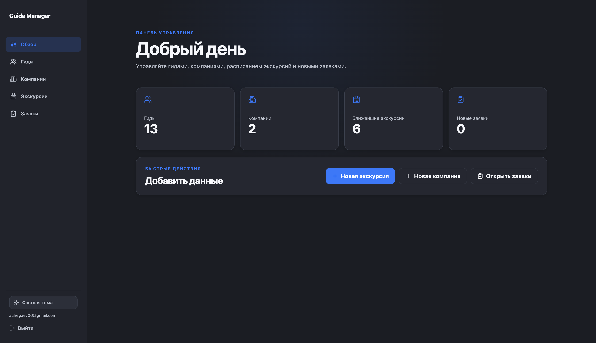
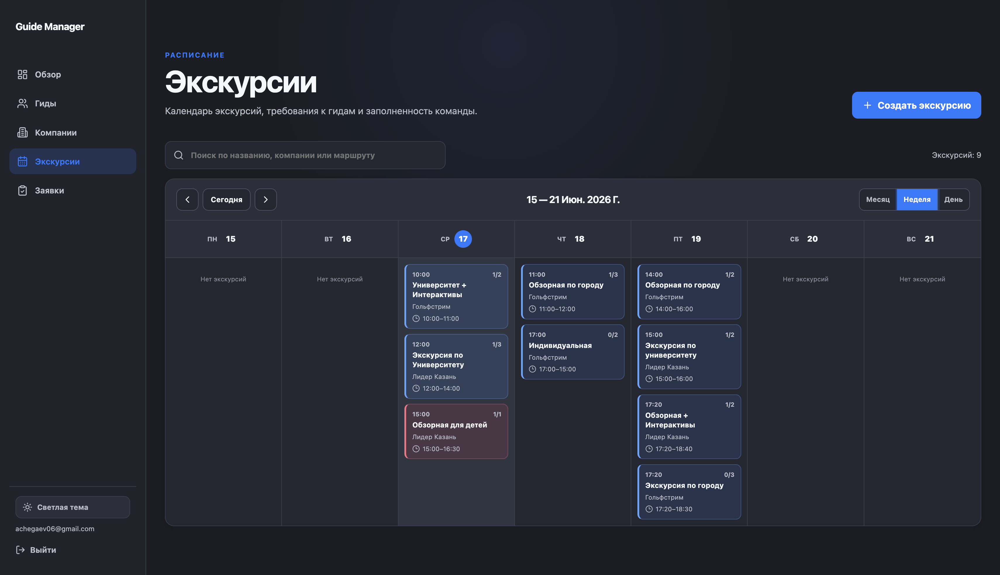
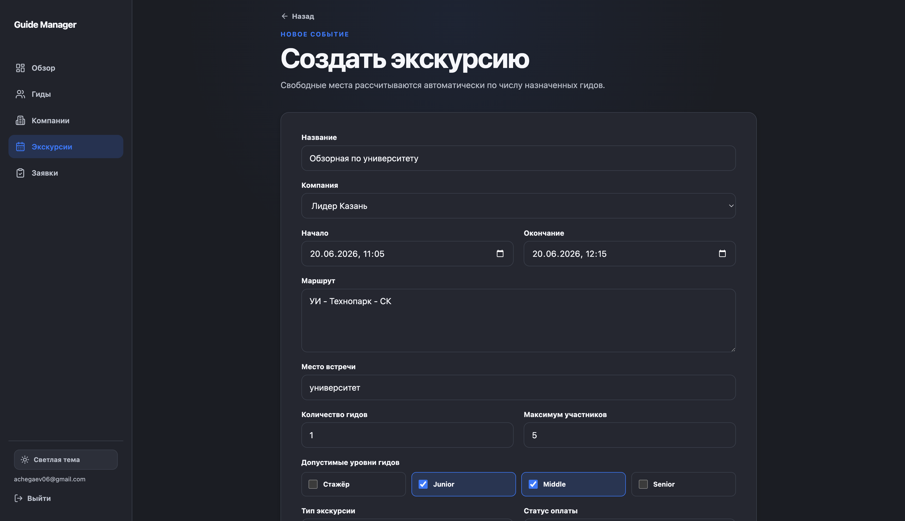
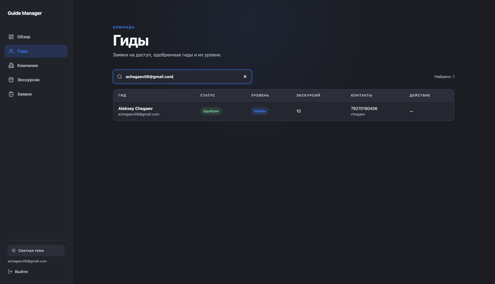
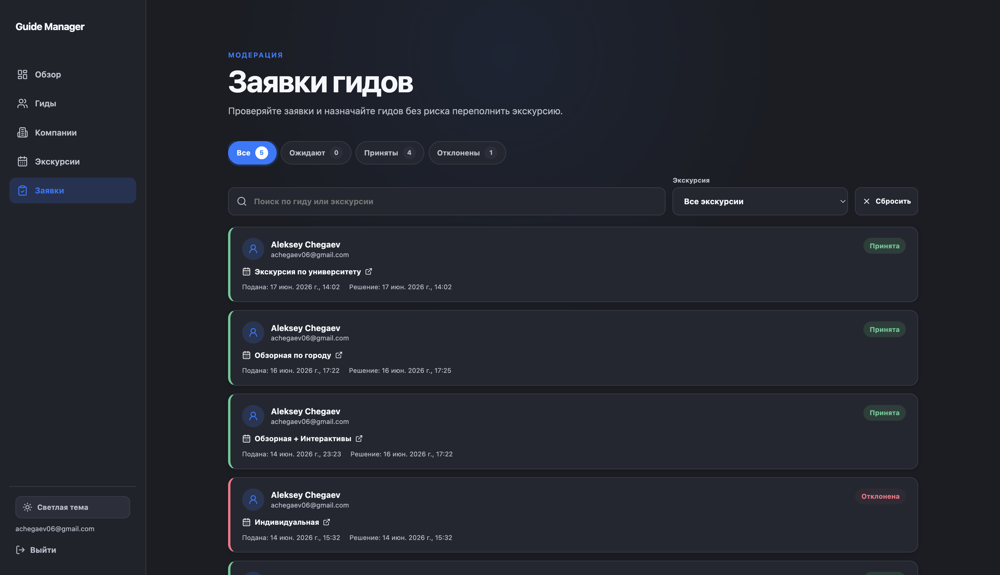

# Guide Manager Admin

**Guide Manager Admin** — web-админка для управления гидами, компаниями, экскурсиями и заявками в системе **Guide Manager**.

Проект является частью full-product связки:

- Flutter client → [Guide Manager](https://github.com/wyroxx/guide-manager)
- Admin panel    → [Guide Manager Admin](https://github.com/wyroxx/guide-manager-admin)
- Backend        → Firebase Authentication + Cloud Firestore

Админка работает без отдельного production backend.
Все данные хранятся в Firebase, а доступ контролируется через Firebase Auth, custom claims и Firestore Security Rules.

## Preview

<p align="center">
  
  
  
  
  
  
</p>

## Возможности

### Авторизация

* вход через Firebase Authentication
* проверка admin-доступа через custom claim `admin: true`
* защищенные маршруты
* отдельное состояние для пользователей без прав администратора

### Управление гидами

* просмотр списка гидов
* поиск по имени и email
* просмотр профиля гида
* редактирование данных
* одобрение зарегистрированных гидов
* назначение уровня доступа

Уровни гидов: trainee, junior, middle, senior

### Управление компаниями

* создание и редактирование компаний
* хранение контактной информации
* удаление компаний
* управление blacklist

Blacklist используется, чтобы ограничивать доступ отдельных гидов к экскурсиям конкретной компании.

### Управление экскурсиями

* календарь экскурсий
* создание и редактирование экскурсии
* настройка даты, времени, маршрута и места встречи
* выбор компании
* указание требуемого количества гидов
* настройка подходящих уровней гидов
* автоматический расчет свободных мест
* удаление экскурсии вместе с заявками

### Управление заявками

* просмотр заявок от гидов
* фильтрация по статусу
* принятие заявки
* отклонение заявки
* добавление комментария к решению
* транзакционное обновление заявки и экскурсии

Статусы заявок: pending, accepted, rejected

При принятии заявки система проверяет, что гид подходит по уровню, не находится в blacklist компании, еще не назначен на экскурсию, а на экскурсии есть свободные места.

## Стек

```txt
React
TypeScript
Vite
Firebase Authentication
Cloud Firestore
Firebase Hosting
React Router
TanStack Query
React Hook Form
Zod
date-fns
lucide-react
```

## Архитектура

Проект использует feature/entity-first структуру:

```txt
src/
  app/
    App.tsx
    router.tsx
    styles.css

  entities/
    application/
    company/
    excursion/
    guide/

  features/
    auth/

  firebase/
    auth.ts
    client.ts
    firestore.ts

  pages/
    ApplicationsPage.tsx
    CompaniesPage.tsx
    DashboardPage.tsx
    ExcursionsPage.tsx
    GuidesPage.tsx
    LoginPage.tsx

  shared/
    constants/
    lib/
    ui/
```

## Firebase data model

Основные коллекции Firestore:

```txt
guides/{uid}
```

Профиль гида.
`uid` документа совпадает с Firebase Auth UID пользователя. После регистрации гид создается как не одобренный пользователь с `isApproved: false`.

```txt
companies/{companyId}
```

Компании-заказчики экскурсий.
В документе компании также хранится blacklist email-ов гидов.

```txt
excursions/{excursionId}
```

Экскурсии с датой, маршрутом, компанией, требуемым количеством гидов, подходящими уровнями и списком назначенных гидов.

```txt
excursions/{excursionId}/applications/{guideUid}
```

Заявки гидов на экскурсии.
ID заявки совпадает с UID гида, поэтому один гид может создать только одну заявку на конкретную экскурсию.

## Security

Доступ к данным контролируется через Firestore Security Rules.

Основная модель доступа:

* админ определяется через Firebase custom claim `admin: true`
* гид получает доступ только после одобрения администратором
* гид может читать только доступные ему, назначенные ему или связанные с его заявками экскурсии
* гид может создать только свою заявку
* заявка создается только если гид подходит по уровню и не находится в blacklist компании
* принятие заявки выполняется через transaction
* при принятии заявки проверяются свободные места, уровень гида и blacklist

Firestore rules находятся в файле `firestore.rules`

## Переменные окружения

Создайте `.env.local` на основе `.env.example`:

```bash
cp .env.example .env.local
```

Пример переменных:

```env
VITE_FIREBASE_API_KEY=
VITE_FIREBASE_AUTH_DOMAIN=
VITE_FIREBASE_PROJECT_ID=
VITE_FIREBASE_STORAGE_BUCKET=
VITE_FIREBASE_MESSAGING_SENDER_ID=
VITE_FIREBASE_APP_ID=
```

Во frontend env нельзя добавлять приватные ключи:

```txt
SERVICE_ACCOUNT
PRIVATE_KEY
FIREBASE_CREDENTIALS
GOOGLE_APPLICATION_CREDENTIALS
```

Service account используется только локально для служебных scripts.

## Локальный запуск

### 1. Установить зависимости

```bash
npm install
```

### 2. Заполнить `.env.local`

Firebase config можно найти в Firebase Console:

```txt
Project settings → General → Your apps → Web app
```

### 3. Запустить dev server

```bash
npm run dev
```

## Проверка проекта

```bash
npm run typecheck
npm run build
```

После успешной сборки Vite создаст папку:

```txt
dist/
```

## Первый администратор

Админка доступна только пользователям с custom claim:

```txt
admin: true
```

Для назначения первого администратора используется локальный script через Firebase Admin SDK.

### Вариант через `GOOGLE_APPLICATION_CREDENTIALS`

```bash
export GOOGLE_APPLICATION_CREDENTIALS=/absolute/path/service-account.json
npm run admin:set -- admin@email.com
```

### Вариант через `FIREBASE_CREDENTIALS`

```bash
FIREBASE_CREDENTIALS=/absolute/path/service-account.json \
  npm run admin:set -- admin@email.com
```

После назначения claim пользователь должен выйти из аккаунта и войти снова, чтобы получить новый ID token.

## Deployment

Админка деплоится на Firebase Hosting как статическое Vite-приложение.

### 1. Проверить Firebase project

```bash
npx firebase-tools projects:list
npx firebase-tools use
```

### 2. Собрать проект

```bash
npm run build
```

### 3. Задеплоить Hosting

```bash
npx firebase-tools deploy --only hosting:admin
```

Production URL:

```txt
https://traveltech-admin.web.app
```

## Связанный проект

Flutter-клиент для гидов:

```txt
https://github.com/wyroxx/guide-manager
```

Клиент используется гидами для:

* регистрации;
* ожидания одобрения администратора;
* просмотра доступных экскурсий;
* подачи заявок;
* отслеживания статуса заявок;
* просмотра назначенных экскурсий в календаре.

## Основной сценарий работы

```txt
1. Гид регистрируется во Flutter-приложении.
2. В Firestore создается guides/{uid} с isApproved: false.
3. Админ открывает Guide Manager Admin.
4. Админ видит нового гида.
5. Админ назначает уровень и одобряет гида.
6. Гид получает доступ к подходящим экскурсиям.
7. Админ создает компанию.
8. Админ создает экскурсию.
9. Гид подает заявку на экскурсию.
10. Админ принимает или отклоняет заявку.
11. Flutter-клиент показывает гиду актуальный статус.
```
